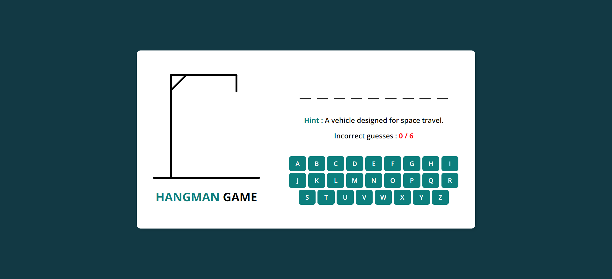
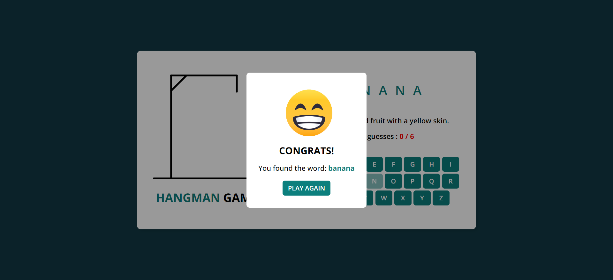
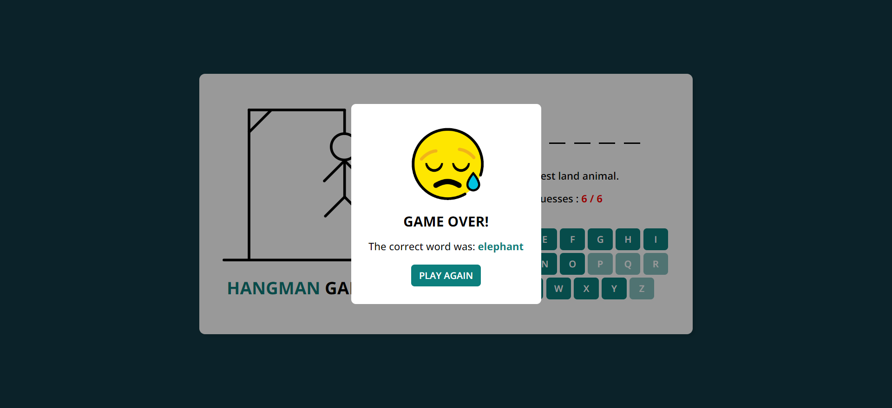

# Hangman Game

## Overview

This is a simple Hangman Game implemented using HTML, CSS, and JavaScript. The game allows users to guess a hidden word letter by letter, with a limited number of incorrect guesses. If the player guesses the word correctly before running out of attempts, they win; otherwise, they lose.

## Features

- Random Word Generation: Each round, a new word is chosen randomly from a predefined list of
  words hints.

- Hints: Each word comes with a hint to help the player guess the word.

- Dynamic Hangman Illustration: The hangman image changes as incorrect guesses are made, showing
  the progression of the game.

- Keyboard Input: Players can click letters on an on-screen keyboard to make guesses.
  End Game Modal: Displays either a victory or game over message when the game ends, along with the correct word if the player loses.

- Play Again Button: Allows players to easily restart the game with a new word.

 

 

## Live Demo :
 https://naglaa99.github.io/hangman-game/